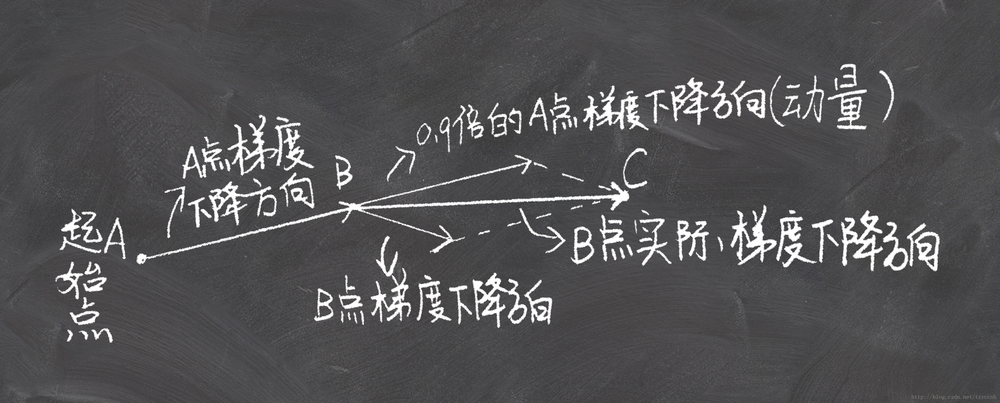
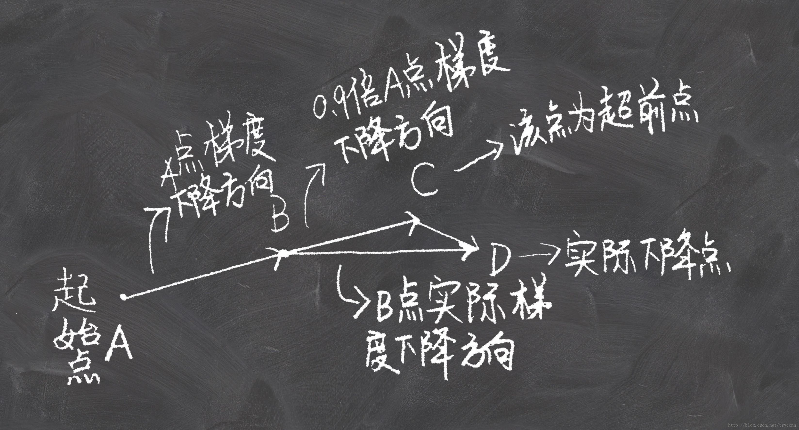

[TOC]

# Lesson 4

- [x] Structured neural net intro

- [ ] Language RNN intro

- [ ] Collaborative filtering intro

## concepts

### dropout

设定一个概率p，让某一层的隐藏单元按概率随机失活，同时对所有隐藏单元的激励值进行放大，也就是乘以1/(1-p)

- 本质是什么：因为按概率随机失活，所以每次训练参与计算的隐藏单元都可能不一样，即每次训练的神经网络都有细小的差别，但是规模结构一致，等同于训练了n个不同的同规格神经网络然后取均值。每个神经网络都可能有不同的过拟合，取均值相当于抑制了这些过拟合，只取了中间比较共同的部分。类似持不同意见的人对同一个问题抛去偏见、达成共识。
- 为什么进行缩放：因为我们训练的时候会随机的丢弃一些神经元，但是预测的时候就没办法随机丢弃了。如果丢弃一些神经元，这会带来结果不稳定的问题，也就是给定一个测试数据，有时候输出a有时候输出b，结果不稳定，这是实际系统不能接受的，用户可能认为模型预测不准。那么一种”补偿“的方案就是每个神经元的权重都乘以一个p，这样在“总体上”使得测试数据和训练数据是大致一样的。比如一个神经元的输出是x，那么在训练的时候它有p的概率参与训练，(1-p)的概率丢弃，那么它输出的期望是px+(1-p)0=px。因此测试的时候把这个神经元的权重乘以p可以得到同样的期望。接上面的说法，训练的时候部分人随机性的不参与，提高参与者的权重，预测的时候所有人都参与，但权重都按概率降低。

### 分类值与连续值

- 分类值categorical，有限的基数cardinality
- 连续值continuous，无限的

### embedding

Embedding层就是以one hot为输入、中间层节点为字向量维数的全连接层！而这个全连接层的参数，就是一个“字向量表”！

Q1. gensim 和 google的 word2vec 里面并没有用到onehot encoder，而是初始化的时候直接为每个词随机生成一个N维的向量，并且把这个N维向量作为模型参数学习；所以word2vec结构中不存在文章图中显示的将V维映射到N维的隐藏层。

A1. 其实，本质是一样的，加上 one-hot encoder 层，是为了方便理解，因为这里的 N 维随机向量，就可以理解为是 V 维 one-hot encoder 输入层到 N 维隐层的权重，或者说隐层的输出（因为隐层是线性的）。每个 one-hot encoder 里值是 1 的那个位置，对应的 V 个权重被激活，其实就是『从一个V*N的随机词向量矩阵里，抽取某一行』。学习 N 维向量的过程，也就是优化 one-hot encoder 层到隐含层权重的过程

参考：

- [秒懂词向量Word2vec的本质](https://zhuanlan.zhihu.com/p/26306795)
- [词向量与Embedding究竟是怎么回事？](https://spaces.ac.cn/archives/4122)

## 协同过滤

- user embedding
- item embedding
- matrix product rating

# Lesson 5

- SGD

  ```json
  W = W - αdW 
  b = b - αdb
  
  其中α是学习率，dW、db是cost function对w和b的偏导数。 
  ```

- SGD with momentum

  

  A为起始点，首先计算A点的梯度$ \nabla a $,然后下降到B点，

  $$
  \theta_{new} = \theta - \alpha\nabla{a} \\
   \theta 为参数，  \alpha  为学习率。
  $$

  到了B点需要加上A点的梯度，这里梯度需要有一个衰减值$ \gamma $,推荐取0.9。这样的做法可以让早期的梯度对当前梯度的影响越来越小，如果没有衰减值，模型往往会震荡难以收敛，甚至发散。所以B点的参数更新公式是这样的：
  $$
  v_t = \gamma v_{t-1} + \alpha \nabla{b} \\
   
  \theta_{new} = \theta - v_t
  $$

  其中$ v_{t-1} $表示之前所有步骤所累积的动量和。
  这样一步一步下去，带着初速度的小球就会极速的奔向谷底。

- SGD with Nesterov accelerated gradient(NAG)

  

  记$ v_t $为第t次迭代梯度的累积
  $$
  v_0=0 \\
  v_1=\eta \nabla_{\theta}J(\theta)\\
  v_2=\gamma v_1+\eta \nabla_{\theta}J(\theta-\gamma v_1)\\
  \downarrow\\
  v_t=\gamma v_{t-1}+\eta \nabla_{\theta}J(\theta-\gamma v_{t-1})
  $$
  参数更新公式

  $$
  \theta_{new} = \theta - v_t
  $$

  公式里的 $ -\gamma v_{t-1} $就是图中B到C的那一段向量，$ \theta-\gamma v_{t-1} $就是C点的坐标（参数）,$ \gamma $代表衰减率，$ \eta $代表学习率。

- adagrad
  前面的一系列优化算法有一个共同的特点，就是对于每一个参数都用相同的学习率进行更新。但是在实际应用中各个参数的重要性肯定是不一样的，所以我们对于不同的参数要动态的采取不同的学习率，让目标函数更快的收敛。

  adagrad方法是将每一个参数的每一次迭代的梯度取平方累加再开方，用基础学习率除以这个数，来做学习率的动态更新。这个比较简单，直接上公式。

  $ ∇_{θ_i}J(θ) $表示第$ i $个参数的梯度，对于经典的SGD优化函数我们可以这样表示
  $$
  \theta_{i\_new}=\theta_i - \eta\nabla_{\theta_i} J(\theta)
  $$
  adagrad这样表示
  $$
  \theta_{i,t+1}=\theta_{i,t}- \frac{\eta}{\sqrt{G_{i,t}+\epsilon}}\nabla_{\theta_{i,t}} J(\theta)
  $$

  t代表每一次迭代。$ \epsilon $ 一般是一个极小值，作用是防止分母为0 。$ G_{i,t} $ 表示了前t步参数 $ \theta_i $梯度的累加
  $$
  G_{i,t} = G_{i,t-1}+ \nabla_{\theta_{i,t}} J(\theta)
  $$

  简化成向量形式
  $$
  \theta_{t+1}=\theta_t- \frac{\eta}{\sqrt{G_t+\epsilon}}\nabla_{\theta_t} J(\theta)
  $$

  容易看出，随着算法不断的迭代，$ G_t $会越来越大，整体的学习率会越来越小。所以一般来说adagrad算法一开始是激励收敛，到了后面就慢慢变成惩罚收敛，速度越来越慢。

- 参考：

  [优化方法总结：SGD，Momentum，AdaGrad，RMSProp，Adam](https://blog.csdn.net/u010089444/article/details/76725843)

