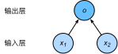

[TOC]

# 数学基础

## 线性代数

- 标量
- 向量
- 矩阵
- 张量

## 微分

- 导数
- 偏导数
- 梯度

## 概率

- 概率分布
- 随机变量

# 深度学习基础

## 单层神经网络

线性回归输出是一个连续值，适用于回归问题。分类问题中模型的最终输出是一个离散值。通常所说的图像分类、垃圾邮件识别、疾病检测等输出值为离散值的问题都属于分类问题的范畴。softmax回归适用于分类问题。二者均属于单层神经网络。

流程：

- 准备、获取数据
- 读取数据
- 定义模型参数
- 定义激活函数
- 定义模型（层级结构及各层假设函数）
- 定义损失函数
- 训练模型

### 线性回归

线性回归假设输出与各个输入之间是线性关系，即模型定义：
$$
\hat{y} = x_1 w_1 + x_2 w_2 + b,
$$
其中$ w_1,w_2 $是权重（weight），$ b $ 是偏差（bias），且均为标量。它们是线性回归模型的参数（parameter）。模型输出$ \hat y $是线性回归对真实价格 $ y $的预测或估计。我们通常允许它们之间有一定误差。

损失函数，均方误差：
$$
\ell(w_1, w_2, b) =\frac{1}{n} \sum_{i=1}^n \ell^{(i)}(w_1, w_2, b) =\frac{1}{n} \sum_{i=1}^n \frac{1}{2}\left(x_1^{(i)} w_1 + x_2^{(i)} w_2 + b - y^{(i)}\right)^2.
$$
优化算法：
$$
\begin{split}\begin{aligned}
w_1 &\leftarrow w_1 -   \frac{\eta}{|\mathcal{B}|} \sum_{i \in \mathcal{B}} \frac{ \partial \ell^{(i)}(w_1, w_2, b)  }{\partial w_1} = w_1 -   \frac{\eta}{|\mathcal{B}|} \sum_{i \in \mathcal{B}}x_1^{(i)} \left(x_1^{(i)} w_1 + x_2^{(i)} w_2 + b - y^{(i)}\right),\\
w_2 &\leftarrow w_2 -   \frac{\eta}{|\mathcal{B}|} \sum_{i \in \mathcal{B}} \frac{ \partial \ell^{(i)}(w_1, w_2, b)  }{\partial w_2} = w_2 -   \frac{\eta}{|\mathcal{B}|} \sum_{i \in \mathcal{B}}x_2^{(i)} \left(x_1^{(i)} w_1 + x_2^{(i)} w_2 + b - y^{(i)}\right),\\
b &\leftarrow b -   \frac{\eta}{|\mathcal{B}|} \sum_{i \in \mathcal{B}} \frac{ \partial \ell^{(i)}(w_1, w_2, b)  }{\partial b} = b -   \frac{\eta}{|\mathcal{B}|} \sum_{i \in \mathcal{B}}\left(x_1^{(i)} w_1 + x_2^{(i)} w_2 + b - y^{(i)}\right).
\end{aligned}\end{split}
$$
在上式中，$ |B| $代表每个小批量中的样本个数（批量大小，batch size），$ η $ 称作学习率（learning rate）并取正数。需要强调的是，这里的批量大小和学习率的值是人为设定的，并不是通过模型训练学出的，因此叫做超参数（hyperparameter）。

线性回归是一个单层神经网络：

线性回归的输出是权重和输入的线性组合，没有激励函数参与。

### softmax回归

Softmax回归是一个单层神经网络：

在线性回归的网络基础上增加了输出，softmax运算

#### Softmax 运算

$$
\begin{aligned}
\boldsymbol{o}^{(i)} &= \boldsymbol{x}^{(i)} \boldsymbol{W} + \boldsymbol{b},\\
\boldsymbol{\hat{y}}^{(i)} &= \text{softmax}(\boldsymbol{o}^{(i)}),
\end{aligned}
$$

#### 交叉熵损失函数

改善上述问题的一个方法是使用更适合衡量两个概率分布差异的测量函数。其中，交叉熵（cross entropy）是一个常用的衡量方法：
$$
H\left(\boldsymbol y^{(i)}, \boldsymbol {\hat y}^{(i)}\right ) = -\sum_{j=1}^q y_j^{(i)} \log \hat y_j^{(i)},
$$
假设训练数据集的样本数为 nn，交叉熵损失函数定义为
$$
\ell(\boldsymbol{\Theta}) = \frac{1}{n} \sum_{i=1}^n H\left(\boldsymbol y^{(i)}, \boldsymbol {\hat y}^{(i)}\right ),
$$

## 多层感知机

多层感知机在单层神经网络的基础上引入了一到多个隐藏层（hidden layer）。隐藏层位于输入层和输出层之间。

### 激励函数

全连接层只对数据做仿射变换（affine transformation），而多个仿射变换的叠加仍然是一个仿射变换，解决办法是引入非线性变换。这个非线性函数被称为激活函数（activation function）

- ReLU函数，只保留正数元素，并将负数元素清零
  $$
  \text{ReLU}(x) = \max(x, 0).
  $$

- Sigmoid函数，可以将元素的值变换到 0 和 1 之间
  $$
  \text{sigmoid}(x) = \frac{1}{1 + \exp(-x)}.
  $$
  依据链式法则，sigmoid 函数的导数
  $$
  \text{sigmoid}'(x) = \text{sigmoid}(x)\left(1-\text{sigmoid}(x)\right).Tanh 函数
  $$

- Tanh（双曲正切）函数可以将元素的值变换到 -1 和 1 之间：
  $$
  \text{tanh}(x) = \frac{1 - \exp(-2x)}{1 + \exp(-2x)}.
  $$
  依据链式法则，tanh 函数的导数
  $$
  \text{tanh}'(x) = 1 - \text{tanh}^2(x).
  $$

## 模型选择、欠拟合和过拟合

### 训练误差和fan

