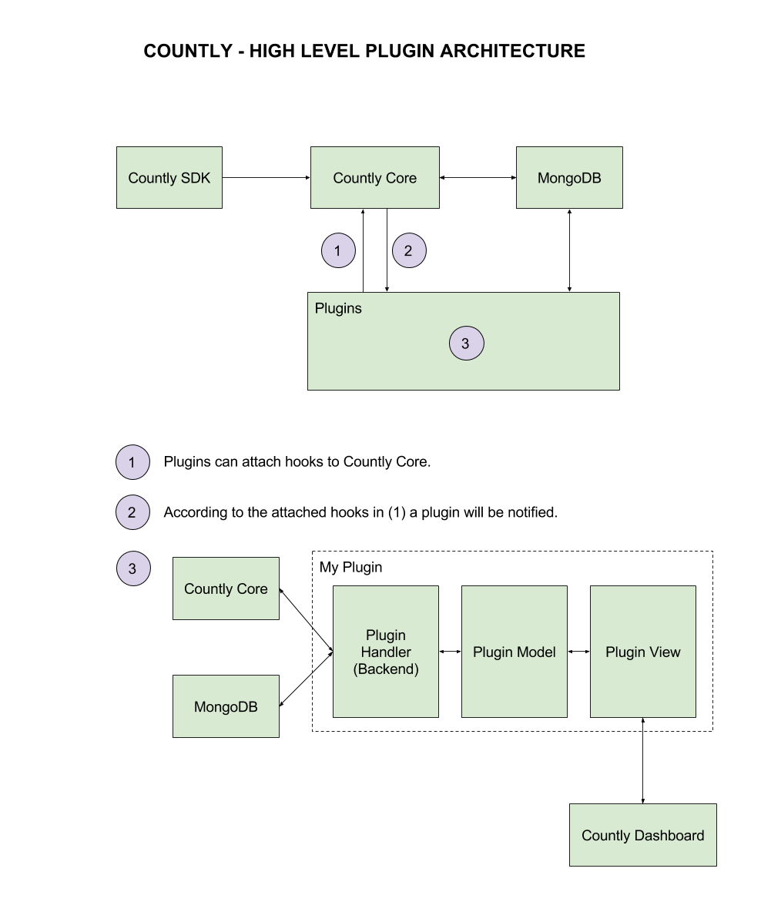
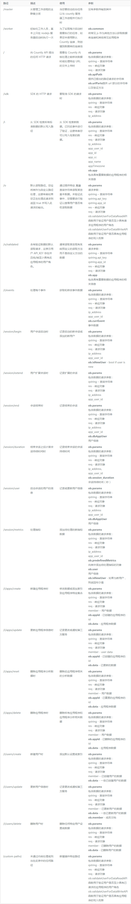
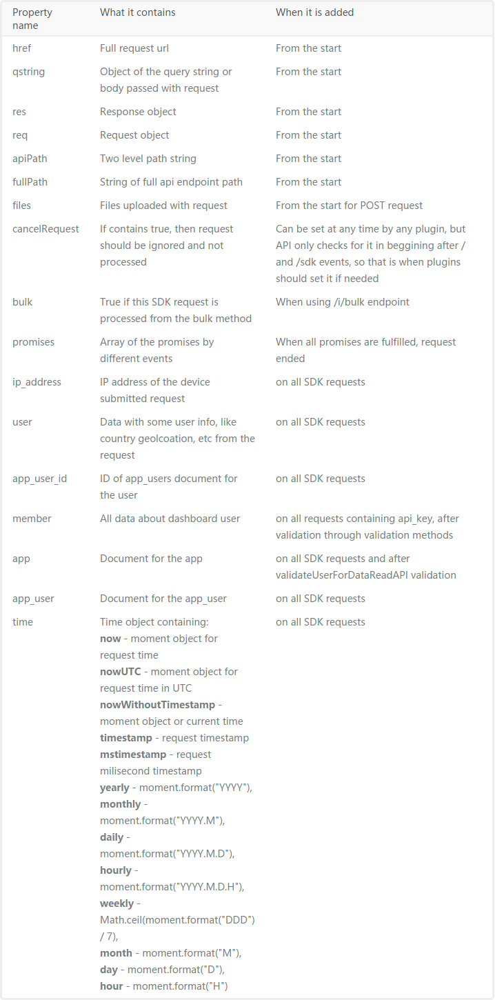
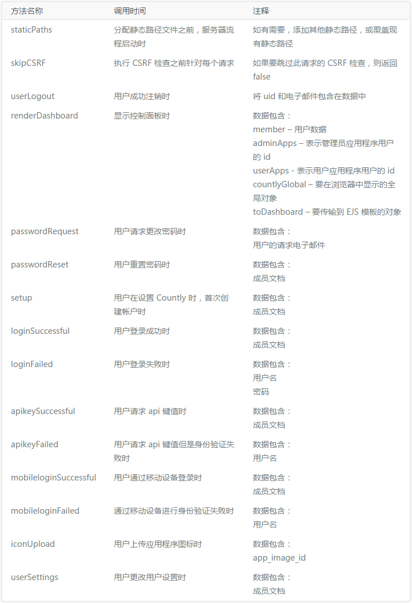

# 整体结构

最新16.12.2源代码结构，前后端分离架构，后端基于nodejs的http模块提供api服务，前端基于Express和Backbone实现SPA应用，前后端分开部署，nginx反向代理实现url分发

```
/countly-server
├── api				// 后端数据接收、处理api
├── bin				// 安装维护脚本
├── extend			
├── frontend		// 前端数据分析仪表盘，backbone框架
├── log
├── plugins			// 插件系统
└── test
```


# 后端（api）

后端是一个纯Restful 接口服务，代码结构如下

```
/api
├─jobs
├─lib
├─parts
│  ├─data
│  ├─jobs
│  └─mgmt
├─utils
├─api.js
└─config.js
```

具体功能：

+ 数据流API
+ 整合插件管理
+ API集群管理


# 前端（frontend）

前端是一个基于backbone的SPA应用，Express提供静态资源托管。前端通过请求后端的数据API提供数据分析仪表盘


# 插件开发

## 简介

自 15.03 版起，Countly 便可以使用插件进行扩展。本指南将描述如何创建您自有的插件以扩展 Countly 功能。


### 概述

要了解如何创建插件，需要完成五个步骤

- [熟悉插件结构，添加/移除插件](http://resources.count.ly/v2.0/docs/plugin-structure)
- [创建 API 部分以处理插件的 REST API 请求](http://resources.count.ly/v2.0/docs/plugin-api-side)
- [创建前端服务器脚本以处理前端请求（如有需要）](http://resources.count.ly/v2.0/docs/plugins-frontend-server)
- [将前端客户端浏览器文件组织到正确的插件结构中](http://resources.count.ly/v2.0/docs/plugins-frontend-browser-files)
- [创建模型获取和管理您的数据和视图以在 Countly 控制面板中显示](http://resources.count.ly/v2.0/docs/plugins-frontend-client-side)
- [修改现有插件的功能](http://resources.count.ly/docs/extending-or-modifying-modules)
- [使用公共文档来存储配置](http://resources.count.ly/docs/shared-configurations)
- [使用Countly的集中式日志系统来更好的调试和输出](http://resources.count.ly/docs/logging)
- [使用MongoDB的文档拆分功能来拆分大量数据](http://resources.count.ly/docs/document-splitting)，集群分片功能？


### 插件管理

plugins目录源码结构

```
/plugins
├── browser
├── compare
├── crashes
├── dbviewer
├── density
├── desktop
├── empty
├── enterpriseinfo
├── errorlogs
├── idfa_fix
├── locale
├── logger
├── mobile
├── pluginManager.js
├── plugins
├── plugins.default.json
├── plugins.json
├── populator
├── push
├── README.md
├── reports
├── server-stats
├── slipping-away-users
├── sources
├── star-rating
├── systemlogs
├── updates
├── views
└── web
```

其中：

+ pluginManager.js 启用/禁用插件并将其与Countly相连
+ plugins.json 包含当前已启用的插件名字的json数组

例如，如果我们已经启用了屏幕密度和区域插件，则plugins.json的内容如下：

```json
["density", "locale"]
```

此外，此文件夹包含所有可用插件，所有新插件也将放在各自的文件夹中。

> ### Important notice
>
> 文件夹名称应该与插件名称相同。


### 开始插件开发

以下是开始开发插件时的一些提示和前提条件。

+ 禁用生产模式

  默认情况下Countly在生产模式下工作，大量的前端文件被压缩和拼接，以加快仪表盘加载。但是当你开发插件时，在某些情况下，你也想修改前端/浏览器端文件。要立即查看更改，必须禁用生产模式。

- 更新本地化文件

  本地化文件被分别处理并合并到一个单独的文件，所以如果您在插件中修改本地化文件，您需要特别地cd到countly目录并运行`grunt locales`，然后这些更改将显示在仪表板中。

- 更新服务器端文件

  由于nodejs进程运行的是预加载的文件，因此每次更新服务器端文件时，您都需要重新启动此进程以使更改生效，这样做只需在服务器上运行`countly restart`

- 使用插件模版

  plugins目录下有个名为empty的插件模版。

  开发插件的最好方法是拷贝empty模版并重命名为自己的插件。

  之后你可以更改插件的package.json中的元数据，添加依赖等等。

  您可以删除`yourplugin/frontend/public/localization/empty.properties`文件，并使用您的插件名称作为文件名创建自己的本地化文件。

  最后剩下的就是在api服务器，前端服务器和前端浏览器端添加内容提供的标准插件文件。


## 插件结构

插件文件夹内部的结构与 Countly 非常相似，都含有 api 部分和前端部分的文件。

还有其他可用文件。

插件结构示例如下：

```
  /dbviewer
  ├── api
  │   └── api.js
  ├── frontend
  │   ├── app.js
  │   └── public
  │       ├── javascripts
  │       │   ├── countly.models.js
  │       │   ├── countly.views.js
  │       │   └── json.human.js
  │       ├── localization
  │       │   ├── dbviewer_de.properties
  │       │   ├── ...
  │       ├── stylesheets
  │       │   └── main.css
  │       └── templates
  │           └── dbviewer.html
  ├── install.js
  ├── node_modules
  ├── package.json
  ├── tests.js
  └── uninstall.js
```

下图显示了Countly插件的高级架构。它清晰的显示了Countly SDK，Countly  Core和数据库如何相互连接以及不同组件如何做的。



  ### package.json

此文件是标准的 nodejs 软件包文件，包含了插件和安装在插件目录中的相关性的信息，以及启用/禁用插件时显示在 Countly 控制面板上的信息。

package.json 内容示例如下：

```json
{
  "name": "countly-empty",
  "title": "Plugin template",
  "version": "0.0.0",
  "description": "Empty plugin template for creating new plugins",
  "author": "Count.ly",
  "homepage": "https://count.ly/marketplace/",
  "repository" :{ "type" : "git", "url" : "http://github.com/Countly/countly-server.git"},
  "bugs":{ "url" : "http://github.com/Countly/countly-server/issues"},
  "keywords": [
    "countly",
    "analytics",
    "mobile",
    "plugins",
	"template"
  ],
  "dependencies": {
  },
  "private": true
}
```

### install.js

启用插件时将执行此文件。编写 install.js 文件时需要考虑：

1) 多次启用或禁用插件时可以多次执行此文件

2) 还会使用此文件升级插件以应用对先前版本所做的更改

3) Countly 不可能在执行此文件时（如安装期间）运行，因此，您必须管理到数据库和其他资料的自有连接

4) 此文件将在单独的节点流程中执行，因此，还必须正确结束文件以结束节点流程。例如，不要忘记在完成修改之后关闭数据库连接

install.js 内容示例：

```javascript
var mongo = require('../../frontend/express/node_modules/mongoskin'),
  async = require('../../api/utils/async.min.js'),
  fs = require('fs'),
  path = require("path"),
  countlyConfig = require('../../frontend/express/config');

console.log("Installing plugin");


console.log("Creating needed directories");
var dir = path.resolve(__dirname, '');
fs.mkdir(dir + '/../../frontend/express/public/folder', function () { });

console.log("Modifying database");
var dbName;
if (typeof countlyConfig.mongodb === "string") {
  dbName = countlyConfig.mongodb;
} else if (typeof countlyConfig.mongodb.replSetServers === 'object') {
  countlyConfig.mongodb.db = countlyConfig.mongodb.db || 'countly';
  //mongodb://db1.example.net,db2.example.net:2500/?replicaSet=test
  dbName = countlyConfig.mongodb.replSetServers.join(",") + "/" + countlyConfig.mongodb.db;
} else {
  dbName = (countlyConfig.mongodb.host + ':' + countlyConfig.mongodb.port + '/' + countlyConfig.mongodb.db);
}
if (dbName.indexOf("mongodb://") !== 0) {
  dbName = "mongodb://" + dbName;
}

var countlyDb = mongo.db(dbName);

countlyDb.collection('apps').find({}).toArray(function (err, apps) {

  if (!apps || err) {
    console.log("No apps to upgrade");
    countlyDb.close();
    return;
  }
  function upgrade(app, done) {
    console.log("Adding indexes to " + app.name);
    countlyDb.collection('app_users' + app._id).ensureIndex({ "name": 1 }, done);
  }
  async.forEach(apps, upgrade, function () {
    console.log("Plugin installation finished");
    countlyDb.close();
  });
});
```

### uninstall.js

与 install.js 类似，禁用插件时只执行此文件。适用于 install.js 的规则也适用于 uninstall.js 文件

### 使用 index.js 进行 tests.js 或文件夹测试

使用 Gruntfile.js 中的 npm test 命令启动所有测试时将执行此文件。

测试执行期间，将使用 JSHint 对所有插件文件进行质量检查然后再执行测试。

测试时您将对创建的 APP_ID、APP_KEY 和 API_KEY 具有访问权限并且可以对前端或 api 执行任何相关测试。

执行测试之后，您必须将应用程序数据重置为待清理。

为了进行测试，您将 [superagent](https://github.com/visionmedia/superagent) 模块用于请求并将 [shouldjs](https://github.com/shouldjs/should.js) 模块用于断言。以及将 testUtils 模块用于设置、数据和有益的方法。

测试前端比 api 部分略微复杂，因为我们需要对用户进行身份验证，然后检索 csrf 以对服务器进行任何 post 请求。使用 testutils 方法使此流程变得更为简单。

检出覆盖不同测试基础的示例：

```javascript
var request = require('supertest');
var should = require('should');
var testUtils = require("../../../test/testUtils");
//请求url
request = request(testUtils.url);

//数据将用于测试
var APP_KEY = "";
var API_KEY_ADMIN = "";
var APP_ID = "";
var DEVICE_ID = "1234567890";

describe('Testing plugin', function () {

  //简单的api 测试
  describe('Empty plugin', function () {
    it('should have no data', function (done) {

      //首次测试时，我们可以检索设置
      API_KEY_ADMIN = testUtils.get("API_KEY_ADMIN");
      APP_ID = testUtils.get("APP_ID");
      APP_KEY = testUtils.get("APP_KEY");

      //并提出请求
      request
        .get('/o?api_key=' + API_KEY_ADMIN + '&app_id=' + APP_ID + '&method=ourplugin')
        .expect(200)
        .end(function (err, res) {
          if (err) return done(err);
          var ob = JSON.parse(res.text);
          ob.should.be.empty;
          done();
        });
    });
  });

  //正在测试前端
  describe('Posting data to front end', function () {
    //我们首先进行身份验证
    before(function (done) {
      testUtils.login(request);
      testUtils.waitLogin(done);
    });
    it('should have no live data', function (done) {
      request
        .post("/events/iap")
        .send({
          app_id: APP_ID,
          somedata: "data",
          //正在获取csrf
          _csrf: testUtils.getCSRF()
        })
        .expect(200)
        .end(function (err, res) {
          if (err) return done(err);
          done();
        });
    });
  });

  //重置应用程序数据
  describe('reset app', function () {
    it('should reset data', function (done) {
      var params = { app_id: APP_ID };
      request
        .get('/i/apps/reset?api_key=' + API_KEY_ADMIN + "&args=" + JSON.stringify(params))
        .expect(200)
        .end(function (err, res) {
          if (err) return done(err);
          var ob = JSON.parse(res.text);
          ob.should.have.property('result', 'Success');
          //等待清除数据
          setTimeout(done, 5000)
        });
    });
  });

  //随后，我们还可以进行测试以验证数据是否已清除
  describe('Verify empty plugin', function () {
    it('should have no data', function (done) {
      request
        .get('/o?api_key=' + API_KEY_ADMIN + '&app_id=' + APP_ID + '&method=ourplugin')
        .expect(200)
        .end(function (err, res) {
          if (err) return done(err);
          var ob = JSON.parse(res.text);
          ob.should.be.empty;
          done();
        });
    });
  });
});
```


## 插件API端

由于 Countly API 端主要是 REST API，而其附带插件机制的工作原理也与之相似，都是通过 api 路径传输事件。

应该将处理 api 请求的文件命名为 api.js，并放在插件目录下的 api 文件夹中，如**{plugin}/api/api.js**

它至少需要通过插件管理器从 Countly api 挂钩到其事件和common.js 以连接到数据库并使用其他有用的方法。

然后，您需要开始注册到它们上面的特定事件和操作。每个事件还会提供其自有的对象以及一些变量，如请求参数等。

示例 api.js 文件如下：

```javascript
var plugin = {},
  common = require('../../../api/utils/common.js'),
  plugins = require('../../pluginManager.js');

(function (plugin) {
  //编写api调用
  plugins.register("/i", function (ob) {
    //获取请求参数
    var params = ob.params;

    //检查是否存在我们所需的数据
    if (params.qstring.user_details) {
      //如果是字符串，但我们期望的是，则对其进行解析
      if (typeof params.qstring.ourplugin == "string") {
        try {
          params.qstring.ourplugin = JSON.parse(params.qstring.ourplugin);
        } catch (SyntaxError) {
          console.log('Parse JSON failed');
          //我们未处理请求
          return false;
        }
        //开始处理请求

        //通过返回 true通知内核我们正在处理
        return true;
      }

      //我们没有感兴趣的数据
      return false;
    }
  });
}(plugin));

module.exports = plugin;
```

### 可用事件路径和参数

目前受支持的事件名称或插件基本上可以监听的插件：

[官方参考手册](http://resources.count.ly/v2.0/docs/plugin-api-side#section-可用事件路径和参数)



### 参数对象

在api端有一个通过许多方法传递的通用对象，它通常存储在名为“params”的变量中。该对象的Contens可以取决于api请求的类型以及处理该请求的阶段

[官方参考手册](http://resources.count.ly/v2.0/docs/plugin-api-side#section-params-object)




### 取消请求

在两种情况下可以取消请求，因此请求不会通过内核进行任何进一步处理。

监听**/**设定路径（任何请求）时，以及监听**/**设定 **sdk** 路径（任何 SDK 请求）时。要取消此请求，所有插件必须将 **params** 对象的**cancelRequest** 设置为 true。

```javascript
plugins.register("/", function(ob){
  ob.params.cancelRequest = true;
});
```

内核将忽略对请求进行进一步处理

### 用户验证

并非所有数据都应该公开可用于添加、编辑、删除，甚至查看任何人向 Countly API 提出的请求。因此，您需要验证用户提供的 API_KEY 是否有权查看修改的数据。

由于一些插件事件是系统直接设置的或是在传输到插件之前验证过的，因此不需要对其进行验证，在少数情况下，还需要验证用户请求。

**"/"** - 处理数据之前提出的任何 http 请求

**"/o"** - 读取基本指标时的路径

**{custom paths}** - 为插件定义的路径

针对此路劲上的插件事件，Countly 提供了验证函数，您可以选择相应函数进行验证。

**ob.validateUserForDataReadAPI** - 用于验证用户是否至少具有请求的应用程序的用户角色的功能

**ob.validateUserForDataWriteAPI** - 用于验证用户是否将权限写入应用程序，将自己添加为管理员或全局权力元的功能

**ob.validateUserForGlobalAdmin** - 用于验证用户是否为全局管理员，以及此处是否需要应用程序 id 的功能

**ob.validateAppForWriteAPI** - 用于验证 APP_KEY 是否属于任何应用程序，且将附加参数添加到参数对象（其中每个 SDK /i 请求都有）的功能。如：

params.app_id - 应用程序 id

params.app_cc - 应用程序国家

params.app_name - 应用程序名称

params.appTimezone - 应用程序时区

params.time - 请求时间

验证示例：

```javascript
var plugin = {},
  common = require('../../../api/utils/common.js'),
  plugins = require('../../pluginManager.js');

(function (plugin) {

  //正在处理一些自定义路径
  plugins.register("/i/ourplugin", function (ob) {

    //获取参数
    var params = ob.params; //请求参数
    var validate = ob.validateUserForDataWriteAPI; //用户验证

    validate(params, function (params) {
      //用户已经过验证 
      //您可以处理请求
    });

    //需要返回true，以便内核不会对路径不存在做出响应
    return true;
  });
}(plugin));

module.exports = plugin;
```

### 处理自定义路径

此外，要预定义事件路径，未通过核心 api.js（基本上未列在参考 api 和上表中）处理的任何路径将通过插件传输。

例如，如果调用如 [http://count.ly/o/foobar](http://count.ly/o/foobar) 之类的路径，首先会将其分派到插件，如果没有插件使用此路径，将通过 api 返回错误消息，指出这是一个不正确的路径。

要向核心说明插件使用此路径或在事件中以异步方式执行某些操作，则必须从事件处理程序中简单地返回true。

此外，当您处理自由自定义路径时，**您的插件负责将任何输出提供到客户端**，否则，此类 HTTP 将会超时。

自定义**/o 路径方式**

> ### 自定义 /o 路径方式
>
> 将内核未处理的方法自定义为 /o 路径，基本上可以将其视为自定义路径。因此，应将其当作一种路径处理，不管插件是否使用请求都会返回布尔值，如果针对插件提出请求，则输出信息

还要注意，在事件中您只需要注册一个子路径，例如 /o/foo 以及所有到 /o/foo/bar1 和 /o/foo/bar2 的请求都会被导向 /o/foo 事件，在此事件中您可以得到路径数组并处理请求。

处理自定义路径的示例如下：

```javascript
var plugin = {},
  common = require('../../../api/utils/common.js'),
  plugins = require('../../pluginManager.js');

(function (plugin) {
  //正在处理自定义路径
  plugins.register("/i/ourplugin", function (ob) {
    //获取参数
    var params = ob.params; //请求参数
    var validate = ob.validateUserForDataWriteAPI; //客户验证
    var paths = ob.paths;
    validate(params, function (params) {
      //用户已经过验证，处理请求
      switch (paths[3]) {
        case 'create':
          //新建对象
          var data = params.qstring;
          //验证是否需要数据并将对象写入数据库
          common.db.collection('ourplugin').insert(data, function (err, app) {
            if (err)
              common.returnMessage(params, 200, err);
            else
              common.returnMessage(params, 200, "Success");
          });
          break;
        case 'update':
          //更新现有对象
          var id = params.qstring.id;
          var data = params.qstring;
          //验证是否需要数据并将对象写入数据库
          common.db.collection('ourplugin').update({ _id: id }, data, function (err, app) {
            if (err)
              common.returnMessage(params, 200, err);
            else
              common.returnMessage(params, 200, "Success");
          });
          break;
        case 'delete':
          //删除现有对象
          var id = params.qstring.id;
          common.db.collection('ourplugin').remove({ _id: id }, function (err, app) {
            if (err)
              common.returnMessage(params, 200, err);
            else
              common.returnMessage(params, 200, "Success");
          });
          break;
        default:
          common.returnMessage(params, 400, 'Invalid path, must be one of /create, /update or /delete');
          break;
      }
    });
    //需要返回 true，以便内核不会对路径不存在做出响应
    return true;
  });
}(plugin));

module.exports = plugin;
```

### 处理指标

Countly 中最常见插件的用途是添加新指标以跟踪数据并显示在控制面板中，如现有指标：分辨率、电信公司等。因此，我们尝试简化此流程以便实现此目标。

添加新指标时，在 API 端首先要做的是执行监听`/session/metrics`事件然后修改指标对象以便收集数据。随后，Countly 内核便可以自动处理指标数据并存储在数据库中。

当然，在某些时候，您需要监听以读取路径 **`/o?method=mymetric`** 并返回此请求的指标数据。

验证用户之后，通过请求 Countly `fetch`模块并使用其辅助方法**`fetch.fetchTimeObj`** 完成指标数据输出

还要考虑的事情是，您需要在应用程序重置或删除时删除指标数据。

在 API 端就是这样。以下是通过添加指标调用我的指标的示例：

```javascript
var plugin = {},
  common = require('../../../api/utils/common.js'),
  plugins = require('../../pluginManager.js'),
  fetch = require('../../../api/parts/data/fetch.js');

(function (plugin) {

  //等待接收指标
  plugins.register("/session/metrics", function (ob) {
    var predefinedMetrics = ob.predefinedMetrics; // 指标对象集

    //通知countly处理我们的指标
    predefinedMetrics.push({
      db: "mymetric", //集合名称
      metrics: [
        {
          name: "_mymetric", //在查询字符串中等待什么
          set: "mymetric", // 指标mymetric
          short_code: "mymetric" //还可以提供简短名称
        }
      ]
    });
  });

  //等待读取请求
  plugins.register("/o", function (ob) {
    var params = ob.params;
    var validateUserForDataReadAPI = ob.validateUserForDataReadAPI;

    //如果用户请求读取我们的指标
    if (params.qstring.method == "mymetric") {

      //对用户进行验证并使用fetchTimeObj方法输出数据
      validateUserForDataReadAPI(params, fetch.fetchTimeObj, 'mymetric');

      //返回true，以便我们对此请求进行响应
      return true;
    }

    //否则，我们不会对此请求感兴趣
    return false;
  });

  //等待应用程序删除事件
  plugins.register("/i/apps/delete", function (ob) {
    var appId = ob.appId;

    //删除指标集合中的所有应用程序数据
    common.db.collection('mymetric').remove({ '_id': { $regex: appId + ".*" } }, function () { });
  });

  //等待应用程序重置事件
  plugins.register("/i/apps/reset", function (ob) {
    var appId = ob.appId;

    //删除指标集合中的所有应用程序数据
    common.db.collection('mymetric').remove({ '_id': { $regex: appId + ".*" } }, function () { });

  });
}(plugin));

module.exports = plugin;
```

就是这样。现在，您可以向 Countly 发送包含您的自有指标的 [标准指标请求](http://resources.count.ly/v2.0/docs/i#optional-parameters) ，自有指标将会和其他指标一样被跟踪。

示例如下：

```json
/i?
begin_session=1
&app_key=YOUR-APP-KEY
&device_id=YOUR_DEVICE_ID
&metrics={
      "_os": "Android",
      "_os_version": "4.1",
      "_device": "Samsung Galaxy",
      "_resolution": "1200x800",
      "_carrier": "Vodafone",
      "_app_version": "1.2",
      "_mymetric": "myvalue"
}
```

> ### /i/bulk requests
>
> 无需特别处理批量请求，Countly 内核会将批量请求拆分为您的插件通常处理的那种单个 /i 请求。


## 前端服务器端文件

由于是在前端服务器端上，因此，Countly 使用Express.js 添加新功能是非常容易的。

通过 EJS 模板，可以轻松将数据传输到您的模板并显示。

应该将处理前端请求的文件命名为 app.js，并存放在插件目录下的 frontend 文件夹中，如**{plugin}/frontend/app.js**

您的 app.js 需要使用单一公共方法 init 导出对象，Countly 会将数据库连接、express app 实例和 express 引用传递到该方法，以便您可以按需要添加任何请求处理或中间件。

> ### Countly 路径前缀
>
> Countly 可能安装在域中的子目录下，在这种情况下，countlyConfig 将具有已定义的路径属性。注册请求通过快速应用程序时需要考虑

示例 app.js 文件如下：

```javascript
var plugin = {},
  countlyConfig = require('../../../frontend/express/config');

(function (plugin) {
  plugin.init = function (app, countlyDb, express) {

    //在此添加您的中间件或处理请求
    app.get(countlyConfig.path + '/ourplugin', function (req, res, next) {

      //获取 url 参数
      var parts = req.url.split("/");
      var id = parts[parts.length - 1];

      //使用 countlyDB 读取数据库中的数据
      countlyDb.collection('ourplugin').findOne({ '_id': id }, function (err, plugindata) {

        //数据是否不可用
        if (err || !att) res.send('404: Page not Found', 404);
        else {

          //显示模板数据	
          res.render('../../../plugins/ourplugin/frontend/public/templates/default', {
            path: countlyConfig.path || "",
            cdn: countlyConfig.cdn || "",
            data: plugindata
          });
        }
      });
    });
  };
}(plugin));

module.exports = plugin;
```

此示例将展现位于` {countly}/plugins/ourplugin/frontend/public/templates/default.html` 下的模板，此模板应该是 EJS 模板，您可以在其中处理和显示预填充的插件数据。

### 拦截请求

通过内核注册任何其他请求之前已将请求注册传输到插件，这意味着任何请求都将首先传输到插件以便您可以进行覆盖或修改。

而在某些情况下，您会想拦截内核注册的请求以基于请求数据执行一些其他任务或修改请求等等。为此，您可以使用快速应用程序注册请求，并使用下一个函数将请求处理传输到 Countly 内核。

```javascript
//在此添加您的中间件或处理请求
app.get(countlyConfig.path+'/login', function(req, res, next) {
      
  //处理请求数据
      
  //通过 Countly 处理自然登录流
  next();
  
});
```

### 更改 Countly 配置

一些 Countly 配置用于前端，甚至已传输到浏览器端并用在模板中。

您可以在插件中对其进行更改。每个 **req** 请求对象还包含 **config** 属性以及 Countly 的前端/快速/ config.js 的内容，您可以对每个特定请求进行单独修改

### 检查用户是否进行身份验证

有些页只有通过身份验证的用户才能访问。要检查用户是否已进行身份验证，只需检查他/她是否具有任何已定义的 uid。

此外，您可能要通过查看会话 gadm 属性来查看用户是否为全局管理员

```javascript
app.get(countlyConfig.path+'/mypage', function (req, res, next) {
  
  //检查用户是否已进行身份验证
  if (req.session.uid) {
    
    if(req.session.gadm){
      //用户是全局管理员
    }
    else{
      //用户是简单的用户
    }
  }
  else
    //重定向到登录页面
  	res.redirect(countlyConfig.path+'/login');
});
```

### 处理 POST 请求

Countly 默认使用body parser中间件，因此处理 POST 请求与获取请求一样简单

- [JavaScript](http://resources.count.ly/v2.0/docs/plugins-frontend-server)

```javascript
app.post(countlyConfig.path+'/mypage', function (req, res, next) {
  
  //通过 post 检索的数据
  console.log(req.body)
  
  //在此显示或重定向用户
  res.end();
  return true;
});
```

可以轻松处理文件上传

- [JavaScript](http://resources.count.ly/v2.0/docs/plugins-frontend-server)

```javascript
app.post(countlyConfig.path+'/mypage', function (req, res) {
  
  //您的文件数据位于 req.files.fieldname 中
  var tmp_path = req.files.fieldname.path,
      target_path = __dirname + "/public/images/image.png",
      type = req.files.app_image.type;

  // 检查文件类型
  if (type != "image/png" && type != "image/gif" && type != "image/jpeg") {
    
    //没有我们所需的，删除文件
    fs.unlink(tmp_path, function () {});
    res.send(false);
    return true;
  }

  //否则，我们会获取图像并复制
  fs.rename(tmp_path, target_path, function (err) {
    
    //移除已上传的文件
  	fs.unlink(tmp_path, function () {});
		
    //我们完成的输出
    res.send("uploaded");
  });
});
```

### 静态路径

在大多数情况下，当为你的插件创建UI时，你会有你的插件特定的CSS和javascript文件，以及模板，应该可以被前端客户端从Web访问。

Countly 内核会自动将您的插件公共目录添加到静态路径列表中，因此， **`{countly}/plugins/yourplugin/frontend/public `**目录下的所有内容都将会自动呈现给所有人。

这些公共资源可以在模板中访问，或者通过 javascript 使用插件名称作为子路径进行加载。

因此，如果您想访问位于 {countly}/plugins/yourplugin/frontend/public/stylesheets/main.css 下的 css 文件，您必需使用 url：[http://yourdomain.com/yourplugin/stylesheets/main.css](http://yourdomain.com/yourplugin/stylesheets/main.css)

此外，如有需要，您可以在前端插件上使用 `staticPaths` 方法指定自有静态路径。

您可以使用相同的方法覆盖一些现有静态文件，如重定向主要 css 请求到一些其他的主题 css 文件。

请注意，您应该使用 staticPaths 方法中的 app.use，因为它是在路由器中间件之前调用的

- [JavaScript](http://resources.count.ly/v2.0/docs/plugins-frontend-server)

```javascript
var plugin = {},
  countlyConfig = require('../../../frontend/express/config');

(function (plugin) {
  plugin.staticPaths = function (app, countlyDb, express) {
    //将静态文件路径重定向到其他位置
    app.use(countlyConfig.path + '/stylesheets/main.css', function (req, res, next) {
      res.redirect(countlyConfig.path + '/ourplugin/stylesheets/main.css');
    });

    //添加您自有的新静态路径
    app.use(countlyConfig.path + "/myfolder", express.static(__dirname + "/myfolder"));
  };
}(plugin));

module.exports = plugin;
```

### 前端方法

大多数情况下，通过 Express.js 的拦截请求方法进行处理，然后再通过 Countly 内核处理。但某些情况下，您可能希望获悉有关一些特定操作或在 Countly 流内进行更改。

例如，您不想监听所有`/login`调用，但您可能需要了解用户成功登录的时间。或者您可能要修改公开到控制面板或传输到 EJS 模板的 javascript 对象。您可能还要取消一些前端请求的 CSRF。

为了实现此目标，您可以为将在某些特定情况下调用的插件对象的前端部分定义方法。

每个方法都会获取以下对象：

- req - 请求对象
- res - 响应对象
- next - express js 下一级回调
- data - 一些其他信息

[官方参考手册](http://resources.count.ly/v2.0/docs/plugins-frontend-server#section-前端方法)



使用前端方法的示例代码

```javascript
var plugin = {},
  countlyConfig = require('../../../frontend/express/config');

(function (plugin) {
  plugin.init = function (app, countlyDb) {
    //按预期在此添加新请求句柄
    app.post(countlyConfig.path + '/nocsrf', function (req, res, next) {
      res.write(true);
    })
  };

  plugin.staticPaths = function (app, countlyDb, express) {
    //将静态文件路径重定向到其他位置
    app.use(countlyConfig.path + '/stylesheets/main.css', function (req, res, next) {
      res.redirect(countlyConfig.path + '/ourplugin/stylesheets/main.css');
    });

    //添加您自有的新静态路径
    app.use(countlyConfig.path + "/myfolder", express.static(__dirname + "/myfolder"));
  };

  //跳过 nocsrf 请求的 csrf
  plugin.skipCSRF = function (ob) {
    if (ob.req.path == countlyConfig.path + "/nocsrf")
      return true;
    return false;
  };

  //添加其他对象以显示在控制面板上
  plugin.renderDashboard = function (ob) {
    //通过浏览器端可以进行访问，如
    //countlyGlobal.myValue
    ob.data.countlyGlobal.myValue = 42;
  }
}(plugin));

module.exports = plugin;
```


## 前端浏览器文件

本页介绍了在 Countly 访客浏览器中执行的代码，这有助于您为 Countly 新建页面和视图。

在浏览器端，Countly 使用 Backbone.js 和 Handlebar 模板库渲染视图，使用模型加载和准备视图数据

>  相对路径
>
>  开发客户端前端需要考虑的一件事就是可以将 Countly 安装在子目录下。因此，请尝试使用相对路径（如在 css 文件或 html 中）或使用 countly 配置路径的绝对路径。

### 所需文件

默认情况下，Countly 期望您具有以下文件：

• 一个位于 stylesheets 文件夹中，名为 mains.css 的 css 文件
• 两个位于 javascripts 文件夹中，名为 countly.models.js 和 countly.views.js 的 js 文件
• 一个位于本地化文件夹中，您支持语言的对应语言文件

这些文件都是 Countly 在默认控制面板模板中自动加载以用于修改 Countly 用户界面的文件。

如果您需要加载其他的 CSS 或 Javascript 文件，您必须在 countly.views.js 文件中动态加载

**本地化**

您要支持的每种语言的本地化文件应该是 [.properties](http://en.wikipedia.org/wiki/.properties) 格式的，但至少要有一个默认的英文文件。

默认英文文件的命名约定是插件名加上属性扩展名，如 ourplugin.properties。

随后将任何其他语言添加到相同的路径下，但按照语言 ISO 标准，会将 Alpha 2 代码附加到默认文件名。

例如：

- [Text](http://resources.count.ly/v2.0/docs/plugins-frontend-browser-files)

```
ourplugin_fr.properties
ourplugin_lv.properties
ourplugin_tr.properties
```

**图像**

如果插件需要显示任何类型的图像，那么这些图像必须位于含有插件名称的文件夹下的图像文件夹中。

**其他文件**

您可以在任何结构中添加任何其他文件，如创建模板目录并添加文件以便稍后可以使用 ajax 请求获取、使用 Handlebar 处理并显示在主干视图中。

**示例**

假设插件名为 "ourplugin"，那么插件目录下的文件位置如下：

- [Text](http://resources.count.ly/v2.0/docs/plugins-frontend-browser-files)

```
 ───frontend
    │
    └───public
        ├───images
        │   └───ourplugin
        │           image1.png
        │           image2.png
        │
        ├───javascripts
        │       countly.models.js
        │       countly.views.js
        │
        ├───localization
        │       ourplugin.properties
        │
        ├───stylesheets
        │       main.css
        │
        └───templates
                tempalte2.html
                template1.html
```

### 生产模式

在开发模式下，插件的每个文件，如 main.css 或 countly.views.js 都会自动从其原始位置请求并按预期方式工作。

但是启用生产模式之后，Countly 会将相似的文件合并为一个文件，然后将其复制到内核。这样，服务器便会在单独请求每个文件时使用较少的 HTTP 请求进行处理。

**Javascript 文件**

每个插件中的两个 Javascript 文件（countly.models.js 和 countly.views.js）都是使用 [Uglify.js](https://github.com/mishoo/UglifyJS)预编译的。因此，您必须确保通过它可以处理您的 Javascript 文件，并且不会因为语法或脚本不正确导致出错。

每个插件的启用或禁用操作使用此编译器来处理所有已启用的插件视图和模型文件，并将它们组合在一起，并保存在`{countly} /frontend/express/public/javascripts/min/countly.plugins.js`文件中。

**CSS 文件**

所有 CSS 文件还会组合成一个单一的文件并存储在 `{countly}/frontend/express/public/stylesheets/main.min.css` 中

但是，由于推荐做法中CSS的所有路径应该使用相对路径（由于Countly可能安装为子目录），所有您对图像的引用在那一点被打破，这就是为什么我们来到我们的最后一点。

**图像**

保持图像结构类似于Countly原始结构的原因是因为在生产模式下复制CSS文件时，还会复制在插件图像目录中具有插件名称的文件夹，以保持与CSS文件的相对链接。

因此，如果您有位于`{countly}/plugins/ourplugin/frontend/public/images/ourplugin`文件夹的图像，那么在生产模式下，它们将被复制和引用
`{countly}/frontend/express/public/images/ourplugin`文件夹保持与CSS文件相同的相对状态。

### 外部依赖项

如果有任何外部 js 或 css 依赖项，将它们分别放在与 countly.view.js 和 countly.model.js 相同的 javascript 文件夹中（或 stylesheets 文件夹对于 css 文件），随后这些依赖项会分别被压缩和合并到文件 countly.plugins.js 和 plugins.min.css 中。因此，在生产模式下，您不需要单独使用它们。

在开发模式下，您需要使用辅助功能加载它们。要区分生产模式和开发模式，请使用全局变量`production`。

- [JavaScript](http://resources.count.ly/v2.0/docs/plugins-frontend-browser-files)

```javascript
if(!production){
  CountlyHelpers.loadJS("ourplugin/javascripts/external.min.js");
  CountlyHelpers.loadCSS("ourplugin/stylesheets/external.min.css");
}
```


## 前端客户端文件

现在让我们讨论如何通过添加新的Countly视图到仪表板为你的插件构建一个UI。

我们知道[某些文件会自动加载到Countly 控制面板](http://resources.count.ly/v2.0/docs/plugins-frontend-browser-files)，现在使用这些文件（基本上是 countly.models.js 和 countly.views.js），我们可以从 API 获取数据并进行显示。

所以，我们需要实现的是：

- 创建一个可以从API获取数据的模型
- 创建一个Backbone视图，它将从模型中获取数据并将其加载到模板中并附加到页面
- 将此视图添加到应用程序路由器
- 注入一些Javascript来修改页面，比如为我们的插件创建一个菜单项

### countly.models.js

现在，我们来定义一个简单的模型，以通过路径 /o?method=ourplugin 从 api 获取数据

- [JavaScript](http://resources.count.ly/v2.0/docs/plugins-frontend-client-side)

```javascript
(function (countlyOurplugin, $) {

  //我们将在此存储数据
  var _data = {};

  //正在初始化模块
  countlyOurplugin.initialize = function () {

    //正在返回承诺
    return $.ajax({
      type: "GET",
      url: "/o",
      data: {
        //正在提供当前用户的 api 键值
        "api_key": countlyGlobal.member.api_key,
        //正在提供当前的 app id
        "app_id": countlyCommon.ACTIVE_APP_ID,
        //正在指定方法参数
        "method": "ourplugin"
      },
      success: function (json) {
        //获取数据并存储
        _data = json;
      }
    });
  };

  //返回我们所拥有的数据
  countlyOurplugin.getData = function () {
    return _data;
  };

}(window.countlyOurplugin = window.countlyOurplugin || {}, jQuery));
```

### 本地化

有两种方法可以在 Countly 中提供本地化的字符串。

通过 javascript 使用全局 jQuery.i18n.map 对象从 localized .properties 文件预先获取值

- [JavaScript](http://resources.count.ly/v2.0/docs/plugins-frontend-client-side)

```javascript
alert(jQuery.i18n.map["ourplugin.hello"]);
```

或者通过数据属性，呈现时元素会含有添加为元素内容的已经本地化的字符串

- [HTML](http://resources.count.ly/v2.0/docs/plugins-frontend-client-side)

```html
<!-- This will be changed  -->
<div data-localize="ourplugin.title"></div>

<!-- To this, automatically -->
<div data-localize="ourplugin.title">Our Plugin</div>
```

### countly.views.js

现在，我们创建一个基本 Countly 视图，以使用模型获取数据

- [JavaScript](http://resources.count.ly/v2.0/docs/plugins-frontend-client-side)

```javascript
window.OurpluginView = countlyView.extend({

  //至少需要提供空的初始化函数
  //防止使用默认模板
  initialize: function () {
    //我们可以在此进行初始化
  },

  beforeRender: function () {

    //检查我们是否已拥有模板
    if (this.template)

      //然后初始化我们的模式
      return $.when(countlyOurplugin.initialize()).then(function () { });
    else {

      //否则获取模板且并行初始化我们的模式
      var self = this;
      return $.when($.get(countlyGlobal["path"] + '/ourplugin/templates/default.html', function (src) {

        //预编译我们的模板
        self.template = Handlebars.compile(src);
      }), countlyOurplugin.initialize()).then(function () { });
    }
  },

  //我们需要在此显示视图
  renderCommon: function () {

    //提供模板数据
    this.templateData = {
      "page-title": "OurPlugin",
      "logo-class": "",
      "data": countlyOurplugin.getData()
    };

    //用数据填写模板，然后将其附加到页面的内容元素
    $(this.el).html(this.template(this.templateData));
  },

  //我们需要在此刷新数据
  refresh: function () {
    var self = this;
    $.when(countlyOurplugin.initialize()).then(function () {

      //我们的视图未激活
      if (app.activeView != self) {
        return false;
      }

      //基本上，我们需要在此执行使用 renderCommon 方法执行的操作
      self.renderCommon();
    });
  }
});
```

然后创建视图实例并将其添加到应用程序路由器的一些特定 url

- [JavaScript](http://resources.count.ly/v2.0/docs/plugins-frontend-client-side)

```javascript
//创建视图
app.ourpluginView = new OurpluginView();

//注册路由
app.route('/ourplugin', 'ourplugin', function () {
	this.renderWhenReady(this.ourpluginView);
});
```

执行这些操作之后，您应该能够通过 [http://yourdomain.com/dashboard#/ourplugin](http://yourdomain.com/dashboard#/ourplugin) 查看视图

### 注入脚本和 html

但是我们不想输入到 url 中，只想通过点击菜单按钮到达那里。要实现这个目的，我们可以插入 html 以呈现我们的菜单项。

这是加载 web 时应该完成的一次性任务，我们只需在这里等待文档就绪并将插件项添加到菜单即可。

- [JavaScript](http://resources.count.ly/v2.0/docs/plugins-frontend-client-side)

```javascript
$( document ).ready(function() {
	var menu = '<a href="#/ourplugin" class="item" ">'+
        '<div class="logo fa fa-plugin" style="background-image:none; font-size:24px; text-align:center; width:35px; margin-left:14px; line-height:42px;"></div>'+
        '<div class="text" data-localize="ourplugin.title"></div>'+
    '</a>';
	
	if($('#management-menu').length)
    //是否在它之前插入管理菜单
		$('#management-menu').before(menu);
	else
    //否则，在菜单末尾插入
		$('#sidebar-menu').append(menu);
});
```

但是，如果我们需要将 html 插入特定视图，加载页面时，它可能无法使用。我们如何了解用户是否已完成此特定视图，如果能够了解，我们就可以进行修改了。

我们可以添加在指定路由上执行的页面脚本。例如，每次用户访问页面 "/dashboard#/analytics/sessions" 时都将执行此脚本

- [JavaScript](http://resources.count.ly/v2.0/docs/plugins-frontend-client-side)

```javascript
app.addPageScript("/analytics/sessions", function(){
   //您可以在此执行任何 dom 操作
   alert("You are viewing Sessions Analytics");
});
```

但是，如果我们需要在每个页面视图上进行操作，情况会怎样？很简单，我们可以使用 # 作为页面脚本路由

- [JavaScript](http://resources.count.ly/v2.0/docs/plugins-frontend-client-side)

```javascript
app.addPageScript("#", function(){
   //您可以在此执行任何 dom 操作
   console.log("new page view loaded");
});
```

您不清楚的动态 URL 前置会怎样？很容易！

- [JavaScript](http://resources.count.ly/v2.0/docs/plugins-frontend-client-side)

```javascript
// URL 以 '/users/'开始后接一些字符串的所有页面，例如：
// /users/c49ebdad8f39519af9e0bfbf79332f4ec50b6d0f
app.addPageScript("/users/#", function(){
   console.log("new user profile view loaded");
});
```

很好，但是有些时候我们需要在视图中进行更改，但是，刷新之后又变为更改前的状态，如何解决这个问题？

我们可以将刷新页面脚本添加到特定路由，就像添加页面脚本一样。

- [JavaScript](http://resources.count.ly/v2.0/docs/plugins-frontend-client-side)

```javascript
app.addRefreshScript("/analytics/sessions", function(){
  //您可以在此执行任何 dom 操作
	console.log("sessions view refreshed");
});
```

### 处理指标数据

插件的常见使用情况是添加新指标，下面我们通过示例来看一下如何显示指标数据。

首先还是通过模型。保存的数据和显示的数据有很大的区别，因此需要对指标数据执行不同的转化，但是，您可以使用辅助方法轻松转化。

- [JavaScript](http://resources.count.ly/v2.0/docs/plugins-frontend-client-side)

```javascript
CountlyHelpers.createMetricModel(window.countlyOurmetric = window.countlyOurmetric || {}, "ourmetric", jQuery);
```

然后我们会创建一个视图以使用模型获取指标数据并生成饼形图和含有数据的数据表

因为我们会使用 Countly 中所用的默认模板，因此我们不需要加载自己的模板。

- [JavaScript](http://resources.count.ly/v2.0/docs/plugins-frontend-client-side)

```javascript
window.OurmetricView = countlyView.extend({
  //初始化模型
  beforeRender: function() {
    return $.when(countlyOurmetric.initialize()).then(function () {});
  },
  
  //显示数据
  renderCommon:function (isRefresh) {
    var data = countlyOurmetric.getData();

    //比较模板数据
    this.templateData = {
      "page-title":jQuery.i18n.map["ourmetric.title"],
      "logo-class":"",
      "graph-type-double-pie":true,
      "pie-titles":{
        "left":jQuery.i18n.map["common.total-users"],
        "right":jQuery.i18n.map["common.new-users"]
      }
    };

    //如果首次加载且未刷新
    if (!isRefresh) {
      
      //使用数据构建模板
      $(this.el).html(this.template(this.templateData));

      //使用图表数据创建数据表
      this.dtable = $('.d-table').dataTable($.extend({}, $.fn.dataTable.defaults, {
        //为数据表提供数据
        "aaData": data.chartData,
        
        //指定要显示的列
        "aoColumns": [
          { "mData": "ourmetric", sType:"session-duration", "sTitle": jQuery.i18n.map["ourmetric.title"] },
          { "mData": "t", sType:"formatted-num", "mRender":function(d) { return countlyCommon.formatNumber(d); }, "sTitle": jQuery.i18n.map["common.table.total-sessions"] },
          { "mData": "u", sType:"formatted-num", "mRender":function(d) { return countlyCommon.formatNumber(d); }, "sTitle": jQuery.i18n.map["common.table.total-users"] },
          { "mData": "n", sType:"formatted-num", "mRender":function(d) { return countlyCommon.formatNumber(d); }, "sTitle": jQuery.i18n.map["common.table.new-users"] }
         ]
       }));
      
      //创建黏着式表标题
      $(".d-table").stickyTableHeaders();
       
      //绘出总数据图表
      countlyCommon.drawGraph(data.chartDPTotal, "#dashboard-graph", "pie");
      
      //绘出新数据图表
      countlyCommon.drawGraph(data.chartDPNew, "#dashboard-graph2", "pie");
    }
  },
  
  //正在刷新图表
  refresh:function () {
    var self = this;
    $.when(countlyOurmetric.refresh()).then(function () {
      
      //不是视图
      if (app.activeView != self) {
        return false;
      }
      
      //填写并重新生成模板数据
      self.renderCommon(true);

      //将视图中的现有元素替换为新数据
      newPage = $("<div>" + self.template(self.templateData) + "</div>");  
       $(self.el).find(".dashboard-summary").replaceWith(newPage.find(".dashboard-summary"));
      
      var data = countlyOurmetric.getData();
      
      //刷新图表
      countlyCommon.drawGraph(data.chartDPTotal, "#dashboard-graph", "pie");
      countlyCommon.drawGraph(data.chartDPNew, "#dashboard-graph2", "pie");
      
      //刷新数据表
      CountlyHelpers.refreshTable(self.dtable, data.chartData);
    });
  }
});

//创建视图
app.ourmetricView = new OurmetricView();

//注册路由
app.route("/analytics/ourmetric", 'ourmetric', function () {
  this.renderWhenReady(this.ourmetricView);
});

//添加菜单项
$( document ).ready(function() {
  var menu = '<a href="#/analytics/ourmetric" class="item">'+
    '<div class="logo"></div>'+
    '<div class="text" data-localize="ourmetric.title"></div>'+
  '</a>';
  $('#analytics-submenu').append(menu);
});
```

我们已将新指标添加到 Countly 安装和其他 API 部分示例，这样，我们便可以与其他人共享插件。

现在我们只需修改 Countly SDK 安装以将我们的自定义指标报告给服务器，即可完成所有操作。


## 扩展或修改模块

所有之前的页面都会显示如何将新功能添加到 Countly。但如果您要修改现有行为会怎样？最好的方法就是直接修改模块。

例如，**countly/api/parts/mgmt** 中的 **mail.js** 模块。如果我们要更改 Countly 默认发送的模板电子邮件会怎样？可以允许我们的插件通过插件管理器修改此模块。这样，需要此模块的任何实例或流程都可以通过我们之前的修改。

那么，我们如何能实现此目标？

首先，我们需要修改 mail.js 模块本身。
实际上已对部分模块进行修改以备扩展，因此，如果您需要对那些尚未扩展的模块进行扩展，可以执行以下操作：

- [JavaScript](http://resources.count.ly/v2.0/docs/extending-or-modifying-modules)

```javascript
//需要插件管理器
var plugins = require('../../../plugins/pluginManager.js');

//扩展模块名为“邮件”的模块和模块对象模块
plugins.extendModule("mail", mail);

//然后仅进行传输以将其导出
module.exports = mail;
```

> ### 扩展其他模块
>
> 目前 mail.js 模块已经修改并且可以扩展，如果您需要修改任何其他模块，您需要进行这些更改。您还可以将 PR 更改提交到我们的存储库，以便更改会对所有 Countly 安装生效。

这就是我们通过插件管理器来扩展模块对象。但里面到底发生了什么，我们实际上是如何修改的？

实际上插件管理器遍历所有插件，并检查插件的 extend 文件夹中是否有 mail 模块。

要扩展 mail.js，您需要扩展插件中含有 mail.js 的文件夹。

标准插件结构如下：

- [Text](http://resources.count.ly/v2.0/docs/extending-or-modifying-modules)

```
│   install.js
│   package.json
│   tests.js
│   uninstall.js
│
├───api
│       api.js
│
├───extend
│       mail.js
│
└───frontend
    │   app.js
    │
    └───public
        ├───images
        │   └───empty
        │           image1.png
        │           image2.png
        │
        ├───javascripts
        │       countly.models.js
        │       countly.views.js
        │
        ├───localization
        │       empty.properties
        │
        ├───stylesheets
        │       main.css
        │
        └───templates
                tempalte2.html
                template1.html
```

此 mail.js 的内容应该导出待调用的函数，从而接收邮件对象并进行修改。例如：

- [JavaScript](http://resources.count.ly/v2.0/docs/extending-or-modifying-modules)

```javascript
module.exports = function(mail){
    mail.sendPasswordResetInfo = function (member, prid) {
        var message = {
            to: member.email,
            subject: 'Let's reset your password ok',
            html:'Hello,<br/><br/>'+
                'So '+ member.full_name + ', did you forget your password?'
        };
    
        mail.sendMail(message);
    };
}
```

我们已通过此方法对要发送给请求密码更改的成员的电子邮件进行了更改，因为导出项目之前，请求此模块的每个流程（api 或前端）都会通过插件管理器中的修改。

但正如先前所说，它还可以应用于其他模块。


## 共享配置

如果需要为插件保存特定配置并在每次请求时使用（甚至可能希望允许用户更改配置值），在此情况下您可以使用共享文档保存配置。

由于共享配置存储在数据库中，因此会在 api 和前端侧、不同 cpu 核心多个进程和多个服务器实例之间共享。

### 设置配置

开始使用共享文档很简单，只需调用 **plugins.setConfigs **方式并为配置传入插件命名空间和默认值。

- [JavaScript](http://resources.count.ly/v2.0/docs/logging)

```javascript
var plugins = require('../plugins/pluginManager.js');

plugins.setConfigs("ourplugin", {
    config1: "value1",
    config2: false,
    config3: 120
});
```

您应尽快完成此操作（最好是在加载 plugins manager 之后）。您可以在 api 侧或前端侧使用（配置将存储在数据库中并在进程之间共享，因此在任意一侧设置都不会产生影响）。

默认情况下，所有配置均可在配置的 Web 用户界面中查看和更改。如果不希望配置出现在 Web 用户界面中，需要让第三个参数为 **true**。

- [JavaScript](http://resources.count.ly/v2.0/docs/logging)

```javascript
plugins.setConfigs("ourplugin_hidden", {
    config1: "value1",
    config2: false,
    config3: 120
}, true);
```

您可以为插件使用多个命名空间，只需确保不与其他插件命名空间发生冲突即可，因此至少尝试使用插件名称为其添加前缀。

### 获取配置值

由于配置值可能发生更改（用户在配置用户界面更改或其他服务器实例更改），因此**不**建议加载配置一次并在之后进行使用。

最好在每次请求时加载配置（同一请求期间可以确保未发生更改，但可能在不同请求之间发生变更），甚至可以按需要加载，使用 getConfig 方式并提供命名空间。

极少数情况下配置无法加载，getConfig 方式确保至少提供空对象，因此您可以轻松恢复默认值。

- [JavaScript](http://resources.count.ly/v2.0/docs/logging)

```javascript
var somevalue = plugins.getConfig("ourplugin").config1 || default_value;
```

### 更新配置

如果出于某些原因需要更新配置，可在下一进程开始时将其添加至 **setConfigs** 方法，该方法将获取旧配置中不存在的新值。

但如果不想等到下一进程开始，比如为不同应用存储不同属性，现在新应用已添加并且要更新配置添加新应用属性。您也可以使用 **updateConfigs** 方法直接更新配置，其中需要传入要添加的数据库对象、命名空间和新属性。

- [JavaScript](http://resources.count.ly/v2.0/docs/logging)

```javascript
//for example we have an object as
plugins.setConfigs("ourplugin", {
  ob1:{
    subob1:{
      prop1:"value1"
    }
  }
};

//if we want to add prop2 to subob1, then we update configs like this
plugins.updateConfigs(common.db, "ourplugin", {ob1:{subob1:{prop2:"value2"}}}, function(){
  //config updated
  console.log("done");
});
```

之后配置将更新，新值在下次请求时可用。

### 配置的 Web 用户界面

插件管理程序也会自动生成用户界面（如果配置未排除），允许全局管理员更改您提供的配置。将检查您的数据类型并提供布尔值开关、用于数字的 HTML5 数字输入以及用于文本值的文本输入。


### 自定义 Web 用户界面输入

但您也可以隐藏特定配置键或为插件配置选项提供自定义输入类型。

您可以在文档加载后使用 **configurationView** 的 **registerInput** 函数。您需要为配置值提供“路径”（使用短划线分隔），返回 null 隐藏值或返回 HTML 代码替换标准输入。

如果设置此配置，例如：

- [JavaScript](http://resources.count.ly/v2.0/docs/logging)

```javascript
plugins.setConfigs("ourplugin", {
  	subobject:{
      subproperty:10
    },
    config1: "value1",
    config2: false,
    config3: 120
});
```

输入中隐藏子对象的子属性，请注册以下函数：

- [JavaScript](http://resources.count.ly/v2.0/docs/logging)

```javascript
$( document ).ready(function() {
  //check if configuration view exists
  if(app.configurationsView){
    app.configurationsView.registerInput("ourplugin-subobject-subproperty", function(value){
      //no html for this input, will hide it
			return null;
		});
  }
});
```

但要覆盖 config1 默认文本输入，需要先为自定义输入提供 HTML 代码（当然还需要确定所需格式）

- [JavaScript](http://resources.count.ly/v2.0/docs/logging)

```javascript
$( document ).ready(function() {
  //check if configuration view exists
  if(app.configurationsView){
    app.configurationsView.registerInput("ourplugin-config1", function(value){
      //return HTML code to textarea
			return "<textarea id='ourplugin-config1' class='mytextarestyle'>"+value+"</textarea>";
		});
  }
});
```

处理期间更改值并设置到配置视图 **updateConfig** 方式

- [JavaScript](http://resources.count.ly/v2.0/docs/logging)

```javascript
app.addPageScript("/manage/configurations", function(){
   if(app.configurationsView){
     	$("#ourplugin-config1").keyup(function () {
        //value might have changed
     		var id = $(this).attr("id");
      	var value = $(this).val();
        //let's notify configuration view about possible changes
				app.configurationsView.updateConfig(id, value);
			});
   }
});
```

### 自定义 Web 用户界面标签

与输入类似，您也可以为标签提供自定义 HTML，包括译为当前语言和提供帮助提示信息等。

要覆盖默认标签名称，只需使用**configurationView** 的 **registerLabe**l 方式并传入 id 和 html 代码替换。

- [JavaScript](http://resources.count.ly/v2.0/docs/logging)

```javascript
$( document ).ready(function() {
  //check if configuration view exists
  if(app.configurationsView){
    app.configurationsView.registerLabel("ourplugin-subobject-subproperty", 
        "<span class='help-zone-vs' data-help-localize='ourplugin.help.subproperty'>Subproperty</span>");
  }
});
```

### 插件特定配置页面

如要在插件视图中提供编辑设置按钮并将用户引导至插件特定配置页面（使用仅用于特定插件命名空间的选项），您可将该按钮指向**“#/manage/configurations/namespace”**（当然需要替换为您的配置命名空间）。

用户将重定向至仅包含该命名空间配置的页面、能够进行更改并使用返回按钮返回插件视图。


## 日志记录

Countly采用集中式日志记录系统。该系统确保一致的日志记录，并具有改变记录仪活动的能力。

要使用Countly日志记录，您需要：

1。通过启动`common.log(“LOGGER_NAME”)` 实例化一个记录仪，其中“Common"的是`API/utils/common.js`模块。您需要通过插件组件名称提供插件名称如“Users”或“Users：API”替换`LOGGER_NAME`

2。采用记录仪的功能之一：`d`，`i`，`w`，`e`。每个功能代表一个不同的日志记录级别：DEBUG，INFO，WARNING，ERROR分别。这些功能参数和`console.log`相同。

请查看以下的插件例子：

- [JavaScript](http://resources.count.ly/v2.0/docs/logging)

```javascript
var plugin = {},
 	common = require('../../../api/utils/common.js'),
 	log = common.log('flows:api'),
 	plugins = require('../../pluginManager.js');
 
plugins.setConfigs('myPlugin', {
 	someConfigurationOption: 5,
});
 
(function () {
 
 	plugins.register('/i', function(ob){
      	var params = ob.params;
      	log.i('myPlugin got a request: %j', params.qstring);
 	});
 
})(plugin);
```

### 日志记录配置

主要日志记录配置是在管理菜单的配置部分：


日志记录的配置包括记录仪名称逗号分隔的列表。记录仪默认值是未在配置中列出日志记录级别。要覆写日志记录级别`WARNING`的模块`api`并将其设置为'DEBUG`，你需要在以上图面用`pushly，api`替换'pushly`。这将自动启用所有`API：XXX`记录仪，除非有一些配置不同的日志级别。

另外注意，Countly启动时不提供这种配置，默认日志记录配置也必须提供给`config.js`。 `config.js`首选项用于启动，然后被存储在MongoDB中共享的配置替换：

- [JavaScript](http://resources.count.ly/v2.0/docs/logging)

```javascript
var countlyConfig = {
    ...
    logging: {
        info: ["jobs"],
        default: "warning"
    }
};

module.exports = countlyConfig;
```


## 文档拆分

指南如何使用拆分包含大量数据的文档

MongoDB有一个文档大小限制，这是绑定到BSON对象大小限制，它是16Mb每个文档。 

即使没有达到限制，根据您对文档的写入量，当文档变大时，写入速度也会变慢。 

因此，有一种文档分割技术，它类似于MongoDB分片，但通过逻辑分割数据在本地进行工作。 

我们在所有指标集合以及事件和用户集合上使用此技术。由于我们正在计算每个指标或用户的总计，因此我们需要确保相同的指标和同一用户总是进入同一个文档。

 因此，例如，当一个运营商指标值出现时，我们取值，使用md5对其进行哈希，在base64中对其进行编码，并获取第一个符号。 

然后我们将这个符号附加到我们将这个指标的集合的id。这样我们几乎平均地将传入指标分为64个拆分文档。

- [JavaScript的](http://resources.count.ly/v2.0/docs/document-splitting)

```javascript
var crypto = require("crypto");

var carrier = "AT&T";

var postfix = crypto.createHash("md5").update(carrier).digest('base64')[0];

var id = app_id+"_2016:0_"+postfix;

common.db.collection("carriers").update({_id:id}, {$set:someUpdate}, {upsert:true}, function(){});

```

每个文档的结构与在单个文档中正常使用时的结构完全相同。 然后只有区别在于，相同的数据被分割到多个文档，每个写入发生在一个较小的文档。

当然，当获取数据时，我们需要获取所有64个文档并将数据合并在一起。 它仍然优于大型文档的写入时间。

- [JavaScript的](http://resources.count.ly/v2.0/docs/document-splitting)

```javascript
var base_id = app_id+"_2016:0";
var docs = [];

//common.base64 is just an array of all possible symbols from 64 alphabet, as
//["0","1","2","3","4","5","6","7","8","9","a","b","c","d","e","f","g","h","i","j","k","l","m","n","o","p","q","r","s","t","u","v","w","x","y","z","A","B","C","D","E","F","G","H","I","J","K","L","M","N","O","P","Q","R","S","T","U","V","W","X","Y","Z","+","/"];

for(var i = 0; i < common.base64.length; i++){
	docs.push(base_id+"_"+common.base64[i]);
}

common.db.collection("carriers").find({_id:{$in: docs}}).toArray(function(err, res){
	//merge data
});
```

我们只是通过加权所有属性来合并它们。


## 调试countly服务器

这是一个关于如何调试Countly服务器的小指南。

>  **NodeJS版本**
>
>  最低支持的NodeJS版本为6.3.0。

>  **需要Chrome**
>
>  此功能需要Chrome浏览器才能运行。

由于调试功能需要至少6.3.0的Nodejs，所以这只能在Countly版本16.12+上。

您可能可以在不同于Chrome的运行调试器，只要它有chrome-devtools。


### 修改服务器配置

第一步是修改Countly服务器`supervisord.conf`配置文件，`Countly/bin/config/`以支持调试。我们需要在node server startup命令中添加“--inspect”参数。您还可以设置“--debug-brk”参数，调试器将在服务器脚本的第一个语句上停止。
在这个例子中，我使用winscp从windows更改配置文件，但你可以使用任何工具最适合你。


您还应该设置服务器仅使用1个工作线程，否则您要调试的代码将运行在您将检查的不同线程中。您应该编辑`config.js`文件中找到的文件`Countly/api/`。


配置完成后，您需要通过调用重新启动服务器`countly restart`。


### 运行调试环境

重新启动服务器后，应打开仪表板中的错误日志或打开“countly / log / countly-api.log”中的服务器上的日志文件。在那里你应该看到提供调试的url。使用每次重新启动服务器时提供的最后一个。


提供的网址应类似于“chrome-devtools://devtools/remote/serve_file/@60cd6e859b9f557d2312f5bf532f6aec5f284980/inspector.html?experiments = true&v8only = true&ws=127.0.0.1:5859 / 8c8a73e5-16b2-4aec-8a51-fee495578​​558”。下一步取决于您要调试的NodeJS服务器是本地还是远程。如果您在本地托管服务器，则不需要进行更改。如果服务器是远程的或托管在本地VM上，则应将“127.0.0.1”替换为服务器IP地址或域名。

您应该将生成的字符串粘贴到您的Chrome或其他兼容的浏览器。它应该在“控制台”选项卡上打开。


“源”选项卡应类似于以下内容：


### 改进工作流程

您可能已经在调试工作流程中注意到了一个小小的障碍。每次对后端进行某些更改时，都需要重新启动服务器。每次重新启动服务器时，都会得到一个新的调试网址。如果你有一个远程服务器，那么每次你还需要替换服务器地址。它变得相当乏味，使调试体验更糟糕，因此应该是。

此问题的解决方案是名为[“NIM（Node Inspector Manager）”](https://chrome.google.com/webstore/detail/nim-node-inspector-manage/gnhhdgbaldcilmgcpfddgdbkhjohddkj)的chrome插件

[](https://files.readme.io/6c65eff-t7.png)

如果您正确设置了NIM，它应该在每次使用“countly restart”重新启动节点服务器时打开正确的URL。

### 使用调试环境

您很快就会注意到，首先不是所有的.js文件都在侧面板中可用，但在使用一些端点或打开一些仪表板页面后，它们变得可见。这些文件是动态加载的。但是一旦你加载它们，你可以在中间打开它们，并让它们可用的所有时间。

这个chrome开发工具类似于任何其他调试器。你可以放置断点，遍历代码和查看值。

你点击行号来放置断点。您可以将鼠标悬停在变量上查看其内容。

[](https://files.readme.io/4b95eeb-t8.png)

在右上角你可以控制当你在断点。通过悬停在你可以看到他们的捷径。例如，F8用于恢复，F10用于跳过，F11用于语句。